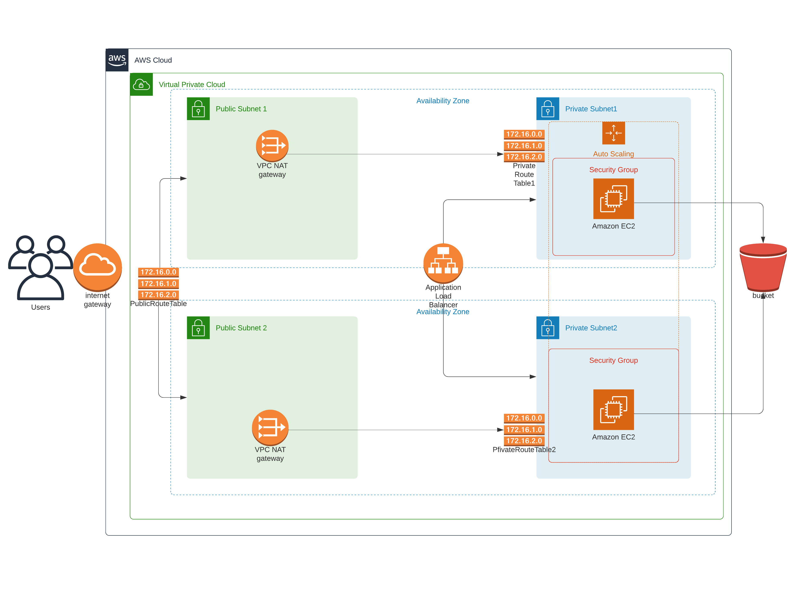

# Project 2 - Deploy a High-Availability Web App using CloudFormation 



> In this project, I deployed web servers for a highly available web app using CloudFormation.

## The files included are:
```sh
* Udagram App: The used application in deployment
* /Images-to-deploy : Screenshots to the deploying steps.
* create.sh : Cloudformation create stack script. 
* update.sh : Cloudformation update stack script.
* destroy.sh : Cloudformation delete stack script.
* infra.yml : Project's CloudFormation script.
* infra.json : Project's CloudFormation script parameters.
```
## Instruction of deploy:

Just run;
```sh
> ./create.sh Project infra.yml infra.json
```
